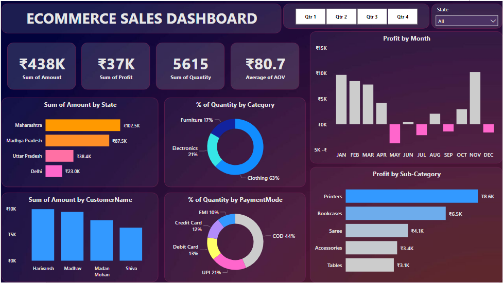

# PowerBI-Ecommerce-Dashboard

Welcome to the E-commerce Sales Dashboard project, a data visualization and analysis tool created using Power BI.

## Overview

This Power BI project provides a comprehensive view of e-commerce sales data, enabling users to analyze and gain insights into key metrics, sales trends, and customer behavior.

## Key Performance Indicators (KPIs)

The E-commerce Sales Dashboard includes the following essential KPIs:

1. *Total Sales Amount:* This KPI represents the total revenue generated from e-commerce sales.

2. *Total Quantity Sold:* It indicates the total number of items sold during the specified period.

3. *Profit Margin:* This KPI represents the sum of profit from e-commerce sales.

4. *Average Order Value (AOV):* AOV is calculated as the average amount spent by a customer in a single order.

## Features

- Visualizes KPIs and sales data with interactive charts and graphs.
- Filters and slicers for customized data exploration.

## Screenshot

## Conclusion

The E-commerce Sales Dashboard provides valuable insights into your e-commerce sales performance, helping you make data-driven decisions. To get started, download the dashboard [here](Ecommerce%20Sales%20Dashboard.pbix).
